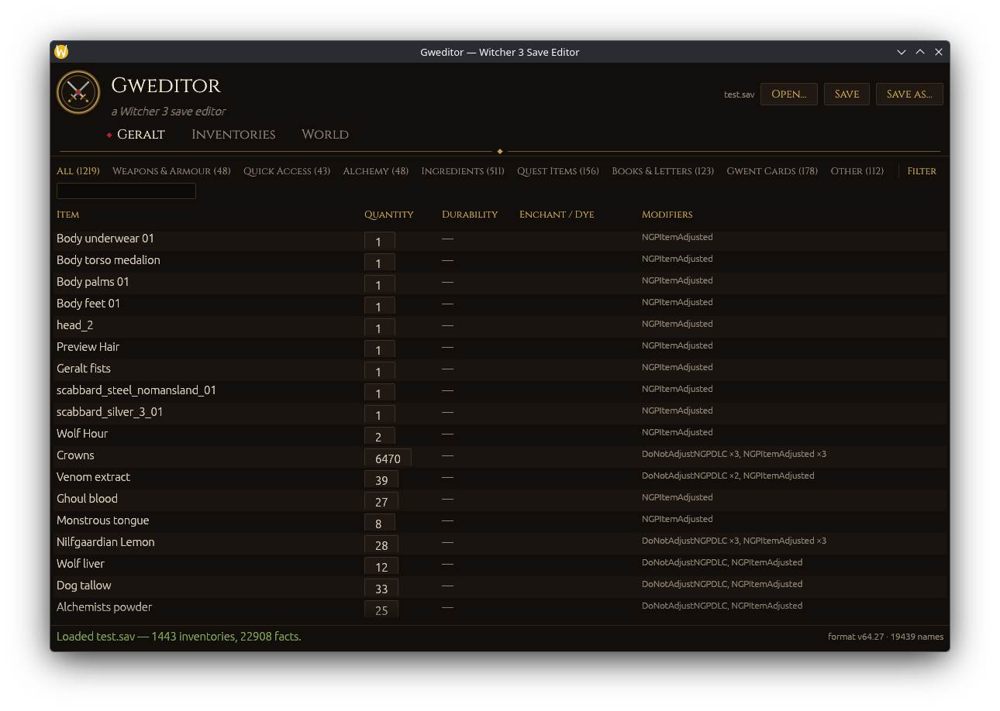

# Gweditor — Witcher 3 Save Editor

A cross-platform save editor for The Witcher 3: Wild Hunt, written in pure
Rust (egui). Supports both old-gen (1.3x) and next-gen (4.x) saves — verified
against real saves from both eras.



## Features

- **Load / Save / Save As** for `.sav` files. Saving over the original file
  creates a one-time `.sav.gwbak` backup next to it.
- **Inventory tab** — every inventory in the save (Geralt, horse, stashes,
  merchants, containers), identified by entity tags. Edit item quantities and
  durability; see enchantments (runewords/glyphwords), dyes and modifiers.
- **World Data tab** — the full facts database (22k+ quest flags and world
  state variables) with editable values.

Edits are applied as in-place byte patches to the decompressed save, so
nothing else in the file is disturbed, then the save is re-chunked and
re-compressed exactly the way the game writes it.

## Usage

```sh
cargo run --release            # open a file via the dialog
cargo run --release -- <save>  # open a specific save
```

The open dialog starts in the Steam (Proton) save directory when it exists:
`~/.steam/steam/steamapps/compatdata/292030/pfx/drive_c/users/steamuser/Documents/The Witcher 3/gamesaves`.

Extra binaries for poking at the format:

```sh
cargo run --release --bin w3dump -- <save> [depth] [--raw]  # dump parsed token tree
cargo run --release --bin w3test -- <save>                  # round-trip + edit self-test
```

## Cross-compiling for Windows

All dependencies are pure Rust (lz4_flex, eframe, rfd), so:

```sh
rustup target add x86_64-pc-windows-gnu
# needs the mingw-w64 linker: pacman -S mingw-w64-gcc
cargo build --release --target x86_64-pc-windows-gnu
```

## Save format notes (reverse-engineered)

Everything below was verified against real 1.31 and 4.04 saves; the token
grammar extends the research from Atvaark's W3SavegameEditor.

- Container: `SNFH` + `FZLC`, chunk count, header size, then a table of
  LZ4-block-compressed chunks (1 MiB decompressed each). All offsets in the
  payload include the header region.
- Payload: `SAV3` magic + 3 version ints (old-gen 64.18, next-gen 64.27),
  token stream, `NM`-wrapped `MANU…ENOD` CName string table, `RB` section,
  variable table, footer (`variable table offset` + `SE`).
- Tokens: `BS` (block start, children via table sizes), `SS` (sized set),
  `BLCK` (name:u16 + **u32** byte size — the old C# tools misread this as
  u16), `VL`/`OP` (name, type, value), `AVAL` (name, type, **value size:i32**,
  value), `PORP` (name, type, size, value), `SXAP` (nested version header),
  `MANU` (string table), and `ROTS`…`STOR` sub-streams wrapping entity /
  component data.
- Facts DB: `SBDF`, count:i32, then per fact: name (length-prefixed string),
  expiring:u16, entryCount:u16, entries of `{value:i16, time:f32,
  expiry:f32}` (10 bytes each).
- Inventory items live in raw (non-token) `CInventoryComponent` blobs inside
  entity streams. Every record contains the invariant field sequence
  `u32(1) + u16(0)` right after `itemName:u16, seed:u16, flags:u16`; the
  editor anchors on that, then reads a flags byte (bit0 = runeword/glyphword
  CName pair follows), dye pair (2 CNames), quantity:u16, durability:f32 and
  a count-prefixed list of 7-byte modifier entries `{CName:u16, value:u32,
  0x02}`.
